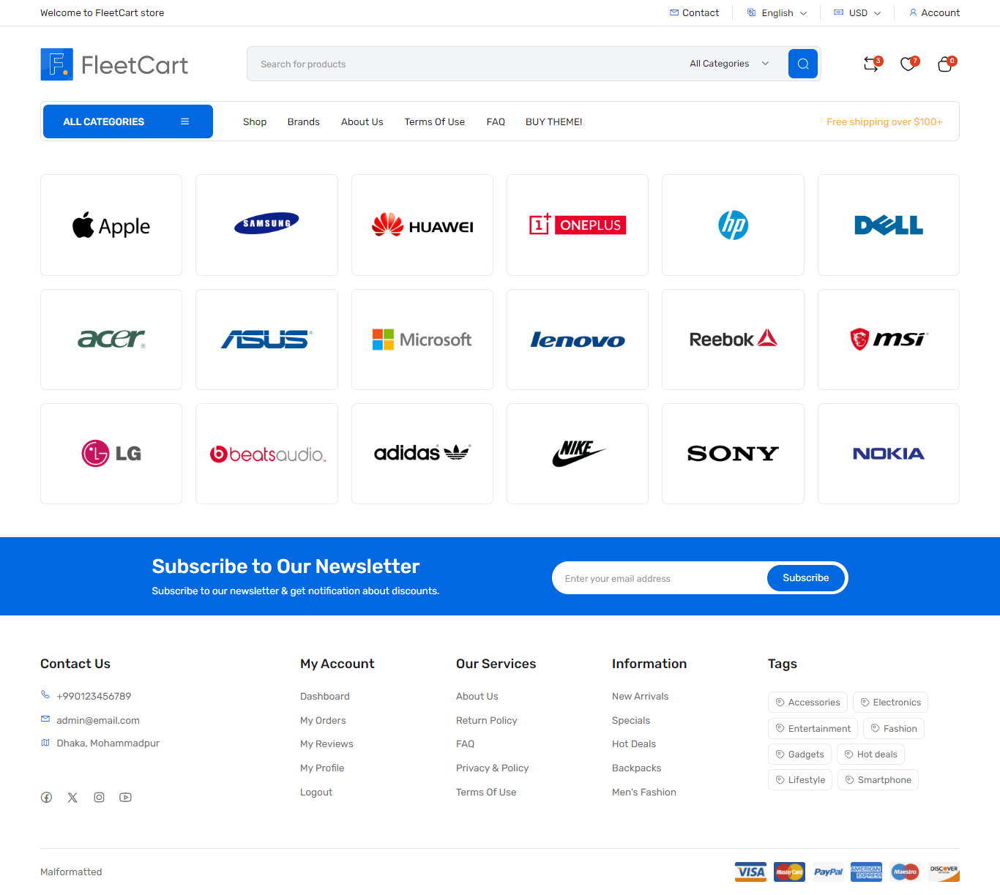
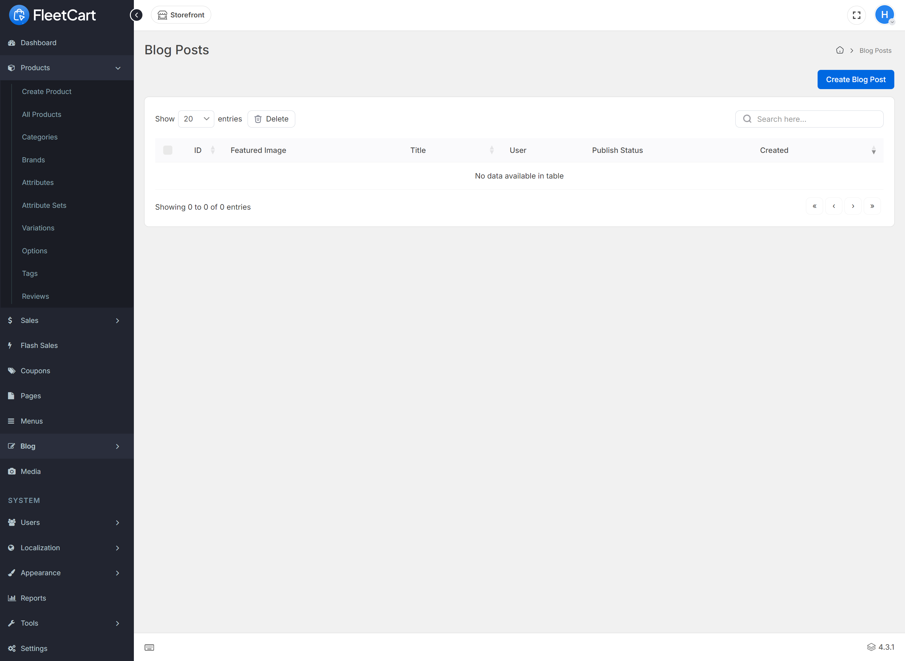
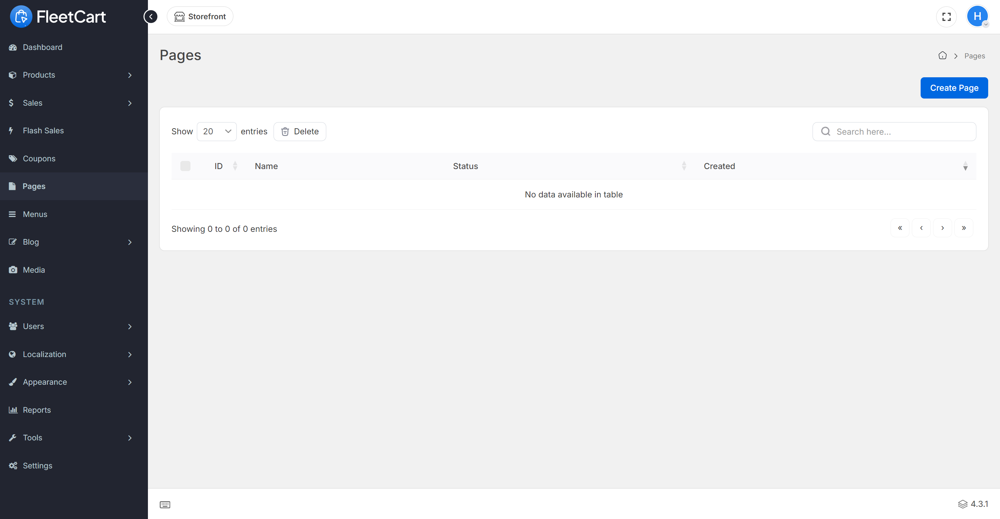

# FleetCart - Laravel Ecommerce CMS

FleetCart is a powerful and feature-rich Ecommerce CMS built with Laravel. It provides a comprehensive solution for creating and managing an online store with ease.

## Features

- **Multiple Language Support**
- **Multiple Currency Support**
- **Product Attributes and Options**
- **Order Management**
- **Brands, Tags, and Reviews**
- **Flash Sales and Coupons**
- **Wishlist and Compare**
- **Guest Checkout**
- **Invoice Generation**
- **Advanced Search and Filtering**
- **SEO Optimized**
- **Beautiful & Powerful Admin Panel**
- **Scheduled Currency Rate Updating**
- **Custom Static Pages**
- **Advanced System Reports**
- **Maintenance Mode**
- **And More...**

## Requirements

- **PHP:** 7.4+ (Recommended: 8.1 or higher)
- **MySQL:** 5.6+ or MariaDB 10.0+
- **PHP Extensions:**
  - Intl
  - OpenSSL
  - PDO
  - Mbstring
  - Tokenizer
  - XML
  - Ctype
  - JSON

## Installation

### Step 1: Extract and Upload

1. Unzip the downloaded archive package.
2. Rename the `FleetCart` directory to your desired directory name.
3. Upload the directory to your web server through FTP or Control Panel.

### Step 2: Creating Database

1. Create a database for FleetCart through your server control panel.
2. If your server has phpMyAdmin, you can also create a database using phpMyAdmin.

### Step 3: Run Installation Wizard

1. Go to your website address.
2. Follow the installation wizard.

**Note:** You should configure your web server's document/web root to be the `public` directory.

### Pre-Installation

The pre-installation page checks if your server meets the requirements and has the correct directory permissions to set up FleetCart. Ensure that directories within the `storage` and the `bootstrap/cache` directories are writable by your web server.

### Configuration

Fill in the database connection details, administration details, and store details, then click the `Install` button to install FleetCart.

### Complete

After successfully installing FleetCart, you will see a success message. You now have the option to browse your online store or log into the administration panel.

## Admin Login

- **URL:** [https://your-domain.com/admin](https://your-domain.com/admin)
- **Email:** `admin@email.com`
- **Password:** `123456`

## User Login

- **URL:** [https://your-domain.com/login](https://your-domain.com/login)
- **Email:** `admin@email.com`
- **Password:** `123456`

## Changelog

### Version 4.3.1 (5 Jul 2024)
- Fix file manager issue

### Version 4.3.0 (3 Jul 2024)
- Add new sidebar cart design
- Add new newsletter popup design
- Add locale switcher in auth pages
- Add ability to change storefront font with 17 fonts preset
- Fix product gallery lightbox duplicate images
- Fix missing translations
- Fix responsive issues
- Improve accessibility
- Improve storefront theme design

... (Include other versions as needed)

## License

This project is licensed under the terms of the [Envato Regular License](https://codecanyon.net/licenses/standard).

## Support

For support, please contact [EnvaySoft](https://codecanyon.net/user/envaysoft).

---

© All Rights Reserved EnvaySoft

## Screenshots

